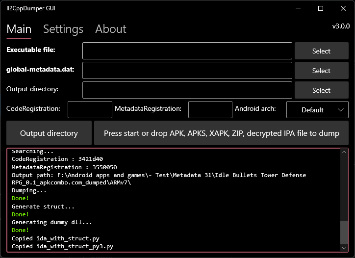

# Il2CppDumper GUI

 

This is the simple GUI version of Perfare's Il2CppDumper. The GUI is based on Bunifu Framework because I like dark theme. Support drag and drop binary files and global-metadata.dat for file selection. APK, APKS, XAPK, ZIP and decrypted IPA file for auto dump

# NO support

Due to the variety and complexity of protection and encryption methods utilized by many games, I cannot offer support or assistance for this project. Consequently, the Issues section is closed. Currently, only Pull Requests are being accepted. Please refrain from contacting me privately or creating unrelated issues on my other projects.

# Requirements
- Windows 7 and above
- .NET 6.0 Desktop Runtime (Windows): https://dotnet.microsoft.com/en-us/download/dotnet/6.0

# Download links

Note: Antivirus may flag this tool as malcious, it is false positive and you should not worry about it. They flag all modding tools you need as malicious, this is their business, this is their way to make money.

Il2CppDumper GUI: https://github.com/AndnixSH/Il2CppDumper-GUI/releases

# How to use

Drop APK, APKS, XAPK, ZIP or decrypted IPA file on the Start button to dump

To manually select files, drop binary file and global-metadata.dat on the textboxes or the Select button, or click Select and choose a file. After that, press the start button to dump

To obtain CodeRegistration and MetadataRegistration, read the following tutorials:
https://tomorrowisnew.com/posts/Finding-CodeRegistration-and-MetadataRegistration/

https://il2cppdumper.com/reverse/examining-the-binary

# Protected games
If you can't dump, try the following methods

- https://www.andnixsh.com/2023/06/how-to-use-zygisk-il2cppdumper-to-dump.html

- https://www.andnixsh.com/2023/05/how-to-use-auto-il2cppdumper-to-dump.html

- https://platinmods.com/threads/protected-il2cpp-dumping-tutorial.130649/

- https://platinmods.com/threads/how-to-dump-protected-libil2cpp-libue4-game-metadata-file-and-other-non-unity-games-new-method.129433/

- https://guidedhacking.com/threads/how-to-dump-protected-il2cpp-games-on-android.17617/

If none of these method helps, maybe do some reversing and decrypt it by yourself

# Credits

AndnixSH (GUI related)

Perfare [Il2CppDumper](https://github.com/Perfare/Il2CppDumper)

djkaty (Helped me fixing an issue and I used some codes from her's [Il2CppInspector](https://github.com/djkaty/Il2CppInspector/)

T5ive (Using some of his codes) [Il2CppDumper-GUI](https://github.com/T5ive/Il2CppDumper-GUI)
