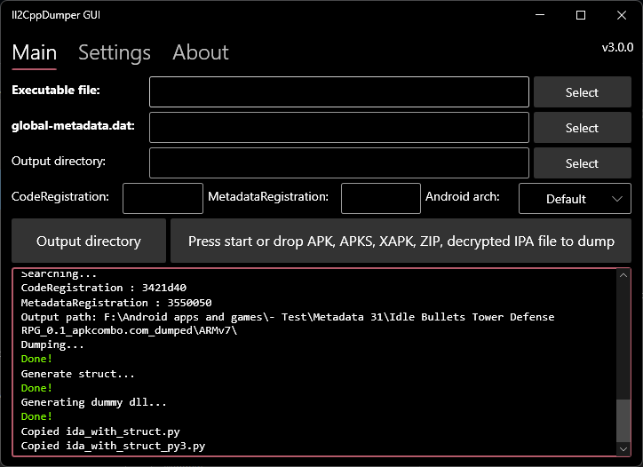

# Il2CppDumper GUI

 

This is the simple GUI version of Perfare's Il2CppDumper. The GUI is based on Bunifu Framework because I like dark theme. Support drag and drop binary files and global-metadata.dat for file selection. APK, APKS, XAPK, ZIP and decrypted IPA file for auto dump

# Note

Due to the variety and complexity of protection and encryption methods utilized by many games, I cannot offer support or assistance for protected games. Consequently, the Issues section is closed. Only Pull Requests are being accepted.

# Features
- Complete DLL restore (except code), can be used to extract MonoBehaviour and MonoScript
- Supports ELF, ELF64, Mach-O, PE, NSO and WASM format
- Supports Unity 5.3 - 6000.5
- Supports Metadata 16 - 39 and 104 - 110 (Unity 6000.5+)
- Supports generate IDA, Ghidra and Binary Ninja scripts to help them better analyze il2cpp files
- Supports generate structures header file
- Supports Android memory dumped libil2cpp.so file to bypass protection
- Support bypassing simple PE protection
- Set output directory
- Set registration offsets
- Support drag and drop
- Performance settings
- Fast mode (skip the slow metadata-usage binary scan)
- Support APK and IPA dump automations

# Requirements
- Windows 7 and above
- .NET 10.0 Desktop Runtime (Windows): https://dotnet.microsoft.com/en-us/download/dotnet/10.0

# Download links

Note: Antivirus may flag this tool as malcious, it is false positive and you should not worry about it. They flag all modding tools you need as malicious, this is their business, this is their way to make money.

Il2CppDumper GUI: https://github.com/AndnixSH/Il2CppDumper-GUI/releases

# How to use

Drop APK, APKS, XAPK, ZIP or decrypted IPA file on the Start button to dump

To manually select files, drop binary file and global-metadata.dat on the textboxes or the Select button, or click Select and choose a file. After that, press the start button to dump

To obtain CodeRegistration and MetadataRegistration, read the following tutorials:
- https://tomorrowisnew.com/posts/Finding-CodeRegistration-and-MetadataRegistration/
- https://il2cppdumper.com/reverse/examining-the-binary

# Outputs

#### DummyDll

Folder, containing all restored dll files

Use [dnSpy](https://github.com/0xd4d/dnSpy), [ILSpy](https://github.com/icsharpcode/ILSpy) or other .Net decompiler tools to view

Can be used to extract Unity `MonoBehaviour` and `MonoScript`, for [UtinyRipper](https://github.com/mafaca/UtinyRipper), [UABE](https://7daystodie.com/forums/showthread.php?22675-Unity-Assets-Bundle-Extractor)

#### ida.py

For IDA (Python 2 / IDAPython 2, older IDA versions)

#### ida_py3.py

For IDA (Python 3 / IDAPython 3, IDA 7.4 and newer). Same as `ida.py` but updated for Python 3 syntax

#### ida_with_struct.py

For IDA, read il2cpp.h file and apply structure information in IDA (Python 2 version)

#### ida_with_struct_py3.py

For IDA, read il2cpp.h file and apply structure information in IDA (Python 3 version, IDA 7.4 and newer)

#### il2cpp.h

Structure information header file

#### ghidra.py

For Ghidra

#### ghidra_with_struct.py

For Ghidra, read il2cpp.h file and apply structure/function signature information in Ghidra

#### ghidra_wasm.py

For Ghidra, work with [ghidra-wasm-plugin](https://github.com/nneonneo/ghidra-wasm-plugin)

#### il2cpp_header_to_ghidra.py

For Ghidra, run inside Ghidra's Script Manager to parse `il2cpp.h` and import all il2cpp structures into Ghidra's Data Type Manager

#### Il2CppBinaryNinja

For Binary Ninja

#### il2cpp_header_to_binja.py

For Binary Ninja, converts `il2cpp.h` into a Binary Ninja-compatible header so its structures can be imported

#### hopper-py3.py

For [Hopper Disassembler](https://www.hopperapp.com/) (Python 3). Reads `script.json` and renames the addresses/methods in Hopper

#### script.json

For ida.py, ghidra.py and Il2CppBinaryNinja

#### stringliteral.json

Contains all stringLiteral information

# Common errors

#### `ERROR: Metadata file supplied is not valid metadata file.`  

Make sure you choose the correct file. Sometimes games may obfuscate this file for content protection purposes and so on. Deobfuscating of such files is beyond the scope of this program, so please **DO NOT** file an issue regarding to deobfuscating.

#### `ERROR: Can't use auto mode to process file, try manual mode.`

Please note that the executable file for the PC platform is `GameAssembly.dll` or `*Assembly.dll`

#### `ERROR: This file may be protected.`

Il2CppDumper detected that the executable file has been protected, use `GameGuardian` to dump `libil2cpp.so` from the game memory, then use Il2CppDumper to load and follow the prompts, can bypass most protections.

# Credits

- AndnixSH (GUI design)

- [Mika Cybertron](https://github.com/MikaCybertron) (Unity 6000.5 / Metadata v104 - v110 support)

- [Axey](https://platinmods.com/members/axey.63365/) (Unity 6 / Metadata v39 upgrade, performance options)

- Perfare [Il2CppDumper](https://github.com/Perfare/Il2CppDumper)

- djkaty ([Il2CppInspector](https://github.com/djkaty/Il2CppInspector/ + Helped me fixing a bug in GUI)

- T5ive [Il2CppDumper-GUI alternative](https://github.com/T5ive/Il2CppDumper-GUI)
